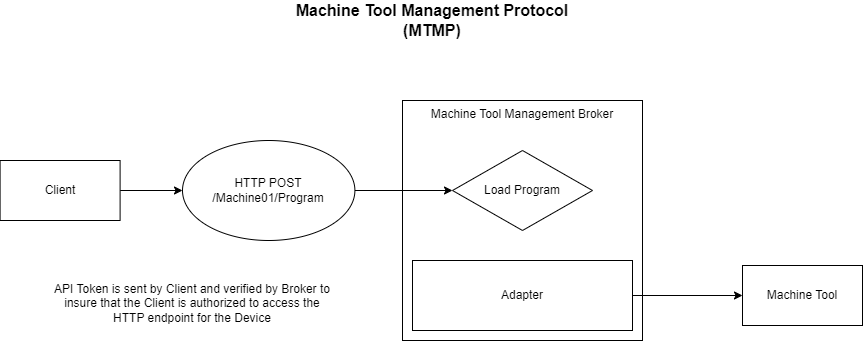

# Machine Tool Managment Protocol (MTMP)
Machine Tool Managment Protocol is a HTTP based protocol used to interface with common functions for managing Machine Tools such as Load Program, Set Tool Offset, Set Variable, etc.



## Purpose
To provide a common HTTP based interface for Loading Programs, Setting Tool Offsets, etc. on a Machine Tool.

## Functions
- Load NC Program
  - POST (/Machine01/program)
    - Request Body = NC Code File Contents
- Set Active NC Program
  - PUT (/Machine01/program/activate?id=EXAMPLE01.NC)
- Set Tool Offset
  - POST (/Machine01/tooloffset/14)
    - Request Body = Tool Offset JSON (see below)
- Set Variable
  - PUT (/Machine01/variable/5601?value=56.123)
  
## Authorization
API Tokens are generated on the MTMP Broker and configured for a specific Machine Connection. A client can then use this API Token to send requests and the Broker can verify that the Client is authorized to make the request.

## Broker
The broker is responsible for hosting the web server used to accept Function Requests. It is also used to host the Adapters that communicate with the machine tool's API.

## Adapter
The Adapters are used to communicate with the specific machine tool API. An example would be a Fanuc Adapter that communicates using the Fanuc FOCAS API.

## Tool Offsets JSON
Below is a draft of what the format should be. Many variations could be possible but most should have a Length and Diameter (in Millimeters). Possibly need to add multiple Lengths (ex. X, Y, Z) and also may need to add a way to send Tool Life info.
```json
{
  "id": "12",
  "description": "An example Tool Offset for Tool #12 with a Length=125.456 and a Diameter=12.002",
  "length": 125.456,
  "diameter": 12.002
}
```


